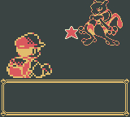
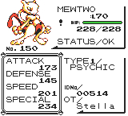

# BBMenuSE
*Blip Blop Menu: Shiny Edition*

---

## 📷 Screenshots

  
    
  
    

    
  
    

    
  
    

---

Compatible with Pokémon Red, Blue and Yellow English versions, as well as VC releases.

BBMenuSE can be installed inside your savegame using [Arbitrary Code Execution](https://glitchcity.wiki/wiki/Arbitrary_code_execution), thus it can run in **original copies**, unlike any other ROMhacks!

## ✅ What BBMenuSE allows you to do:
- Use constant effects like **Running, Walking through Walls, Beast Mode, Trainer Avoidance** etc.
- Get any **Item, Pokémon** or **Moveset**. 
- Instantly encounter any **Pokémon** or **Trainer** (yes, OAK is included!).
- Instantly get max **Money, Coins, Badges** etc.
- Launch custom **mini-games** like **Snake**!
- All from an in-game menu, with a simple press of **Select button**!
- And... see whether Pokemon are **shiny** in battle or on the summary screen!
- Plus shiny hunt **wild Pokemon**!

More details in [here](https://github.com/aestellic/BBMenuSE/blob/main/Features.md).

---

## ✅ Requirements
- A **Gameboy** or **3DS** console or a compatible **emulator** (BGB recommended).
- An **original** copy of English **Pokémon Red, Blue or Yellow**, a **VC release** or an **original ROM file**.
- TimoVM's [modernized ACE](https://glitchcity.wiki/wiki/Guides:TimoVM%27s_gen_1_ACE_setups) setup.
- Latest version of [TimOS](https://glitchcity.wiki/wiki/Guides:Nickname_Writer_Codes).
- A cup of coffee and a huge amount of patience, installation will literally take about 5 hours to complete!

---

## 🔗 Installation

After setting up TimOS (required), you need to insert all [hex code parts](https://github.com/aestellic/BBMenuSE/tree/main/Installation), the same way you did with the ACE setup.
- Copy and paste the code from part1 in the [Nickname Converter](https://timovm.github.io/NicknameConverter/).
- Write all nickname codes in Nickname Writer and press start in the verification screen of the last code to run it.
- If you input everything correctly the game does not crash and you can make a save (required for parts 1, 2, 9, and 11). In different case, reset and repeat.
- Repeat the procedure until every hex part is installed. Other parts do not require saving the game, since the payloads are installed directly into the save file.

**If migrating from stock BBMenu, you only need to (re)install parts 2, 9, 10, 11, and 12. Remember that you must save after installing parts 2 and 9.**

---

## ⚠ Warnings - Before you proceed, please make sure to read the following!
- **DO NOT OPEN** BBMenuSE with SELECT button until the installation is complete, otherwise a crash is guaranteed, especially if parts 2 and 3 are missing!
- During nickname input, code in part 1 is crucial. If you dont input EXACTLY what is shown, there is a high chance your savegame will be messed up!
- Always double check that you copy and paste every single byte. This is the stupidest, yet most common way to say goodbye to your save file!
- **Slip script** allows you to walk through walls. Although it includes some basic prevention, walking outside map's borders risks crashing the game with your savegame being deleted! **Use with Caution!**
- Emulator compatibility was only tested with [BGB](https://bgb.bircd.org/) (everything works) and mGBA (everything works when using an SGB bios). If you're using an emulator other than BGB, **make sure to use a BIOS file.**

## ⚠ Notes
Part codes from 2-8 are more tolerant to input errors, since their payloads activate only through BBMenuSE and a crash can indicate which part you need to reinstall.
That being said, here is what every part includes:
- Part1: Kernel stuff
- Part2: Constant effect payloads
- Part3: BBMenuSE layout
- Part4: Run, Slip, Repel, Beast, StealRun, Stealth, Fly, Heal, PC, Items scripts
- Part5: Moves, Pokemon, Wilds scripts
- Part6: Trainers, Instatext, Filldex, Badges, Cash, Coins, Duplicator scripts
- Part7: Pong
- Part8: Snake
- Part9: Shiny Indicator, Animation, SFX, DV Fix
- Part10: Shiny Indicator, Animation. SFX, DV Fix Enabler

---

## 📋 Premade Save Files

If the installation process seems too daunting for you, there are premade save files avaiable [here](https://github.com/aestellic/BBMenuSE/tree/main/Saves)!

---

### 🔧 How it works:
Pokémon Generation 1 games contain a large amount of unused space within their save files. BBMenuSE takes advantage of this by storing its data there through Arbitrary Code Execution (ACE). When the game loads, BBMenuSE uses specific hijacking techniques to inject its kernel into memory and load any required libraries.

The kernel continuously runs active payloads in the background and can trigger the script menu on demand. Each menu payload is first copied into WRAM before it runs. This design ensures full compatibility with Virtual Console (VC) releases, which cannot execute code directly from the save file — unlike the original Game Boy cartridges.

---

## 💬 Contact

Feel free to fork, reuse, or propose new modules!
- You can find me in [GCRI Discord server](https://discord.gg/EA7jxJ6), ping @aestellic.

---

## 🧠 Credits

- Pret for [Red](https://github.com/pret/pokered) and [Yellow](https://github.com/pret/pokeyellow) disassemblies, which allowed us to reverse engineer crucial game logic and make the menu and shiny indicator functional.
- [RGBDS](https://rgbds.gbdev.io/), the incredibly powerful compiler used for this project.
- [QuickRGBDS wrapper](https://github.com/M4n0zz/QuickRGBDS), which made this super complicated project easier to build.
- TimoVM from [Glitch City Research Institute](https://glitchcity.wiki/wiki/Main_Page) and his [ACE guides](https://glitchcity.wiki/wiki/Guides:TimoVM%27s_gen_1_ACE_setups).
- [M4n0zz](https://github.com/M4n0zz) from Glitch City Research Institute for creating the QuickRGBDS and the original BBMenu, as well as helping me with creating BBMenuSE.
- [Cilerba](https://www.youtube.com/@Cilerba), who originally added [shiny indicators to vanilla Red and Blue via ACE](https://github.com/cilerba/ace).
- The Gears of Progress [[YT](https://www.youtube.com/@thegearsofprogress1964)] [[GH](https://github.com/GearsProgress)], who created a proof of concept shiny animation for Gen I and inspired me to fully implement it within this project.
- Everyone in [GCRI Discord channel](https://discord.gg/EA7jxJ6). Thank you folks for your motivation and support!